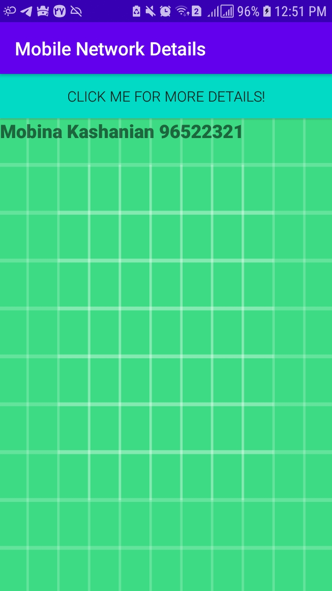

# Mobile Parameters

This repository contains a project that extracts the following parameters from the user's mobile phone and displays them.

#### Parameters:
1) IMSI (International Mobile Subscriber Identity)
2) IMEI (International Mobile Equipment Identity)
3) PLMNID (Public Land Mobile Network-Identity)
4) Information about Serving Cells and Neighbor Cells

## Language
The project is written in Java(Android).

## Images
I hid my information.
</img> 
</img>
</img>
## Contributing
Pull requests are welcome. For major changes, please open an issue first to discuss what you would like to change.

Please make sure to update tests as appropriate.

## License
[MIT](https://choosealicense.com/licenses/mit/)
